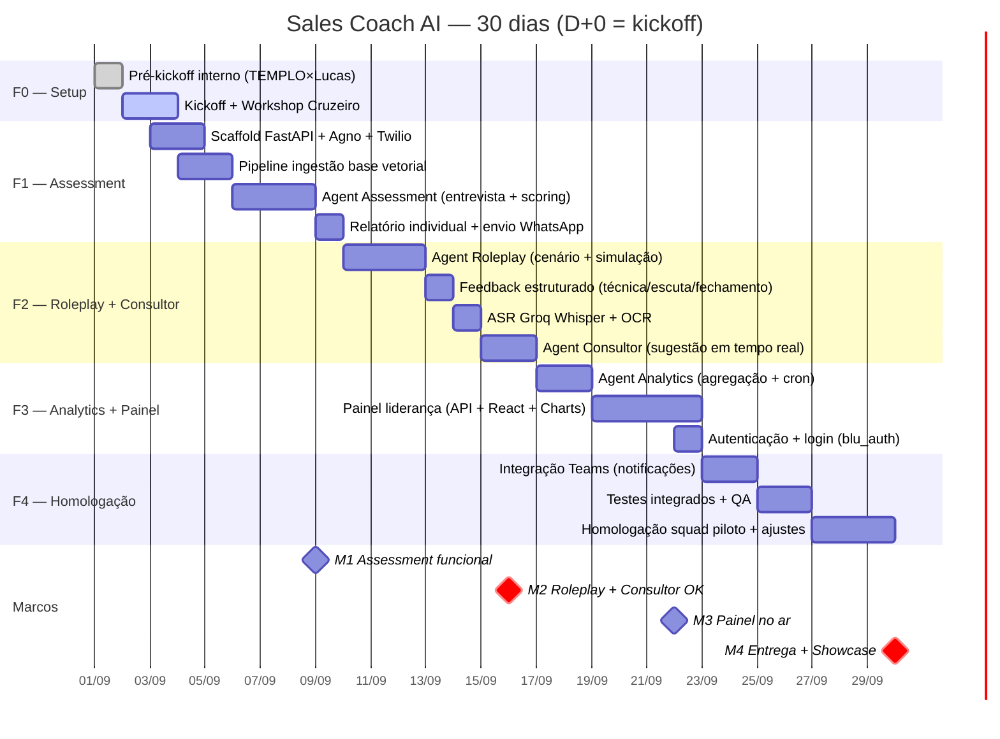

# ROADMAP — Sales Coach AI (30 dias)

> **D+0 (kickoff):** 01/09/2026 (assumido)
> **Entrega final:** 30/09/2026
> **Dias úteis:** ~22

---

## 1. Restrições contratuais

- Prazo máximo: **30 dias corridos** (01/09 a 30/09)
- Carga de IA: USD 200 (Claude Code 20x) + até USD 800 extras
- Infra (Cloud Run, Supabase, Twilio, banco): responsabilidade TEMPLO
- Base de conhecimento da Cruzeiro: entregue **no workshop de kickoff**
- Rituais: pré-kickoff interno, kickoff, weekly com GP, showcase final

## 2. Fases

### F0 — Setup + Kickoff (D1–D2)

- Pré-kickoff interno (TEMPLO + Lucas)
- Kickoff com Cruzeiro do Sul
- Workshop de calibração: captura da base de conhecimento
- Setup do ambiente de desenvolvimento
- Setup Langfuse para prompts versionados
- **Setup do MCP**: `pip install mcp[cli]`, criação do servidor FastMCP

### F1 — SalesCoachRegistry + Modo Assessment (D3–D8)

- Scaffold do serviço FastAPI + Agno (1 imagem)
- **SalesCoachRegistry**: estrutura de modos + Agent Factory
- Integração Twilio WhatsApp + webhook + Router
- **blu_prompt_management**: carga de prompts da Langfuse em runtime
- Base vetorial: pipeline de ingestão (Supabase pgvector)
- **Modo Assessment**: entrevista conversacional + scoring + relatório via WhatsApp
- Setup dos prompts "sales-coach/router" e "sales-coach/assessment" na Langfuse

### F2 — Modos Roleplay + Consultor (D9–D15)

- **Modo Roleplay**: geração de cenário + simulação + feedback
- **Modo Consultor**: ASR (Groq Whisper) + OCR + sugestão em tempo real
- Router inteligente: classificação de intenção entre modos
- Sessão persistente (TenantPostgresDb)
- Setup dos prompts "sales-coach/roleplay" e "sales-coach/consultor" na Langfuse

### F3 — Modo Analytics + Painel (D16–D22)

- **Modo Analytics**: pipeline de agregação (cron diário)
- Setup do prompt "sales-coach/analytics" na Langfuse
- Painel da liderança: API + frontend React
- Autenticação (blu_auth)

### F4 — Integração + Homologação (D23–D30)

- Integração Teams (notificações)
- Testes integrados + QA em ambiente TEMPLO
- Homologação com squad piloto (ajustes finos)
- Showcase de apresentação de resultados

## 3. Gantt

## 4. Marcos

| Marco | Data | Critério de sucesso |
|-------|------|---------------------|
| M1 — Assessment funcional | 09/09 | Entrevista completa rodando via WhatsApp, score gerado, relatório enviado |
| M2 — Roleplay + Consultor OK | 16/09 | Cenário gerado, simulação funcional, feedback emitido, áudio transcrito, sugestão devolvida |
| M3 — Painel no ar | 22/09 | Painel web com dados reais (métricas dos agentes), autenticado |
| M4 — Entrega + Showcase | 30/09 | Sistema completo em produção, squad piloto treinado, apresentação de resultados |

## 5. Riscos do Roadmap

| Risco | Impacto | Mitigação |
|-------|---------|-----------|
| Base de conhecimento não entregue no workshop | Atraso no assessment (F1) | Baseline mínimo de 10 cursos para começar; preencher o resto depois |
| Infra TEMPLO não pronta (Twilio, Cloud Run, Supabase) | Bloqueia deploy | Setup de dev local (Supabase local, Twilio sandbox) para não parar |
| OCR de imagens de baixa qualidade | Consultor com foto não funciona | MVP do consultor só texto + áudio; foto como P2 |
| Squads piloto com baixa adesão | Homologação inconclusiva | Coordenadores engajarem os vendedores top 10 primeiro |
| Complexidade dos 4 agentes em 30 dias | Escopo estoura prazo | Priorizar F1 + F2 (assessment + roleplay); F3 (painel) versão simplificada; F4 (Teams) fase tardia |